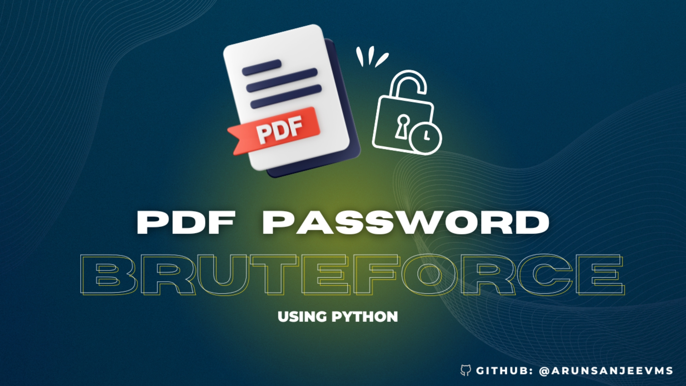

<center><h1>PDF Bruteforce Using Python</h2></center>
<center>



<br>

```bash
         .-----------------------------.           
         |  Tool  : PDF Bruteforce     |           
         | Github : ️@arunsanjeevms     |           
         '-----------------------------'  
 ```
 </center>


  ## 💉 Import necessary libraries / modules:
  
  <br>
  <ul>
  
```bash
  pip install pikepdf 
```

```bash
  pip install tqdm
```

```bash
  pip colorama pyfiglet

```

  <ul>
    <li><code>pikepdf</code>: Used for working with PDF files.</li>
    <li><code>tqdm</code>: A progress bar library for showing the progress of tasks.</li>
    <li><code>filedialog</code> and <code>Tk</code> from <code>tkinter</code>: Used for GUI file selection dialogs.</li>
    <li><code>colorama</code>, <code>pyfiglet</code>, and <code>init</code> from <code>colorama</code>: Used for adding color and styling to the output text.</li>
  </ul>
  
  <br>

  <li><h3>📁 It prompts the user to select two files:</li>
  <ol>
    <li> A text file containing a list of passwords ( wordlist.txt ).</li>
    <li> The protected PDF file ( which to be bruteforced ).</li>
    <br>
  </ol>
  
  <li>It reads the passwords from the selected text file and stores them in a list.</li>
  <li>It iterates through each password in the list and attempts to open the protected PDF file using the current password.</li>

<li>If the PDF file is damaged or corrupted, it prints an error message and suggests trying another PDF file. <li>If the password is incorrect, it continues to the next password in the list.

<p>This script can be useful for scenarios where users need to recover passwords for protected PDF files, provided they have a list of potential passwords. However, it's important to note the disclaimer stating that misuse for unauthorized access is prohibited.</p>


## 🔗 Links
<div align=center>

[](https://tinyurl.com/visitmethere) &nbsp; &nbsp;&nbsp;&nbsp;&nbsp;&nbsp;&nbsp;&nbsp;&nbsp;&nbsp;
[](https://www.linkedin.com/in/arunsanjeev/)


